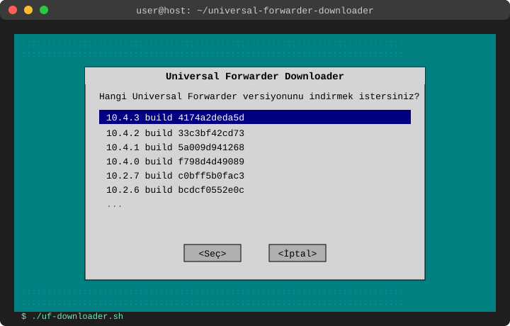

# Universal Forwarder Downloader

A small bash tool for downloading Splunk Universal Forwarder Linux (amd64)
`.tgz` packages. Pick the version you want from a menu, and the script
finds the right build hash and fetches the package directly from
`download.splunk.com`.



> The image above is an illustrative mockup of the selection menu the
> script opens with `whiptail` (not an actual screen capture) — the real
> look will vary slightly depending on your terminal and `whiptail`/`dialog`
> theme.

## Usage

```bash
./uf-downloader.sh                # pick a version from the menu
./uf-downloader.sh 10.4.3         # give the version directly as an argument
./uf-downloader.sh 10.4.3 /opt    # ...and set the download directory
```

When run without arguments:

1. It lists the versions in `version.list`, newest to oldest, in a menu.
2. It uses `whiptail` if installed, `dialog` if not, or a plain numbered `select` menu as a last resort — so it still runs on a host without `whiptail`/`dialog`.
3. It looks up the chosen version's build hash in `version.list`.
4. It downloads from `https://download.splunk.com/products/universalforwarder/releases/<version>/linux/splunkforwarder-<version>-<build>-linux-amd64.tgz`.
5. It verifies the downloaded file isn't empty; on any error it removes the partial file.

## version.list

`version.list` contains the Universal Forwarder version/build-hash pairs
that are still actually live on Splunk's site (current + previous-releases
pages), as CSV: `version,build`. Versions that are no longer downloadable
are not kept in the list — this file needs updating whenever a new Splunk
release ships.

## Requirements

- `bash`, `curl`
- (optional, for a nicer menu) `whiptail` or `dialog`
